# 🧾 Sistema de Inventario en Python

## 📌 Descripción

Este programa Guarda y carga el inventario desde archivos CSV para conservar los datos entre sesiones, compartirlos y consultar estadísticas del negocio.

Aplica listas, diccionarios y tuplas junto con módulos y funciones en Python para construir un inventario modular y persistente: operaciones CRUD, estadísticas y lectura/escritura de archivos CSV con validaciones y manejo de errores

👉 feature/H3_Modulo-3

------------------------------------------------------------------------

## 🚀 ¿Cómo acceder a esta versión del proyecto?

Para trabajar con esta versión desde tu computador, sigue estos pasos:

### 1. Clonar el repositorio

``` bash
https://github.com/Dan623280/Proyecto-Inventario-Pyton.git
```

------------------------------------------------------------------------

### 2. Entrar a la carpeta del proyecto

``` bash
cd Proyecto-Inventario-Pyton
```

------------------------------------------------------------------------

### 3. Cambiar a la rama correcta

``` bash
git checkout feature/H3_Modulo-3
```

------------------------------------------------------------------------

### 4. Descargar los archivos de la rama

``` bash
git pull origin feature/H3_Modulo-3
```

------------------------------------------------------------------------

## ▶️ Ejecutar el programa

Una vez dentro de la rama correcta, ejecuta:

``` bash
python app.py
```

------------------------------------------------------------------------

## ▶️ Como utilizar el programa

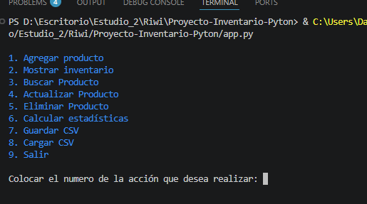

El programa al iniciar muestra un menu Dependiendo de la accion que el usuario desea realizar.

## Agregar producto

Si el usuario desea agregar producto selecciona en el menu el numero 1, 
automaticamente el programa le pedira colocar el nombre, el precio y la cantidad. 

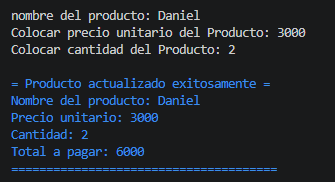

Al final el programa mostrara los datos registrados y el total a pagar.

## Mostrar inventario

En este apartado se observa todos los productos registrados con su indice

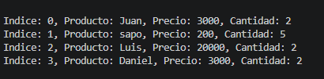

## Buscar Producto

En este espacio muestra el dato del producto por el nombre


## Actualizar Producto

En este apartado se muestra los productos con su indice y se puede actualizar el producto por el indice

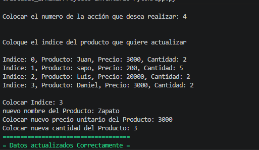

## Eliminar Producto

En este apartado se muestra los productos con su indice y se puede Elminar el producto por el indice

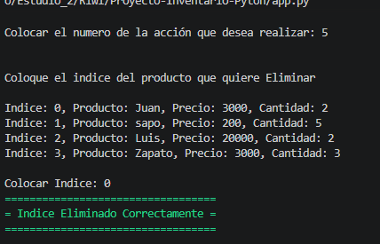

## Calcular estadistica

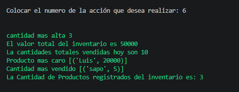

En esta parte se muestra

unidades_totales = suma de cantidad
valor_total = suma de precio * cantidad
producto_mas_caro (nombre y precio)
producto_mayor_stock (nombre y cantidad)

## Guardar CSV

Al seleccionar esta opcion se guada los datos de la lista del inventario al csv

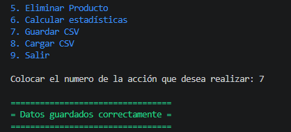


## Cargar CSV

Al cargar, pregunta al usuario:
“¿Sobrescribir inventario actual? (S/N)”
Si S: reemplaza inventario por lo cargado.
Si N: fusiona por nombre:
Si un nombre ya existe, actualiza precio/cantidad u omite (define una política y muéstrala al usuario; por defecto, actualiza cantidad sumando y si el precio difiere, actualiza al nuevo).

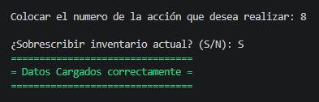

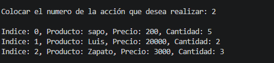

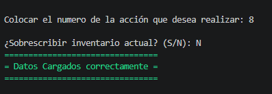

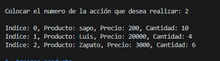

------------------------------------------------------------------------
## 👤 Autor

Daniel Alvarez

------------------------------------------------------------------------

## 🔗 Repositorio

👉 https://github.com/Dan623280/Proyecto-Inventario-Pyton.git
